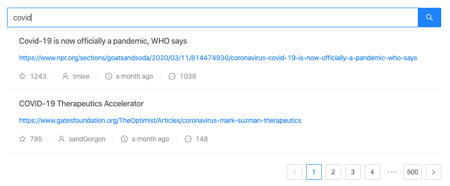

# Sample HackerNews client built on React and Redux with unit tests

## What is this project for ?
This project is to discuss basic practices to write unit tests in a React + Redux web app. All discussions and ideas are welcome. The sample app built a simple hacker news client with pagination and search. The tech stack is React + Redux + Ant Design. I use Jest + React Testing Library for testing.




## Why should I consider about front-end tests?
There has been many discussions around this topic, here is my opinion
1. Secure your efforts on building complicated logic, in big projects, it's very for easy for anyone to accidently change your valuable logic.
2. You apply TDD. e.g. when fixing a bug, you can implement your hypothesis in tests so you can test and secure your solution.
3. If your unit tests are secured enough, then it's easier to breath and test when doing big refactoring or optimisation in code.

There are more reasons, above are my own findings. Feel free to share yours.

## I am using debounce for a triggering event, how can I test ?
Using debounce will only fire the function after it last ran for X ms. After you trigger the event in the test, you will need to wait for the timeout of X ms of your debounce before continue checking. In this example, I implemented a helper called waitForTimeout to wait until the debounce is done. See example [src/components/news/NewsList/component.spec.jsx:68](./src/components/news/NewsList/component.spec.jsx#L68)

## I created a snapshot testing yesterday, it was fine but broke today?
May be there is some rendering logic that uses current time of testing .e.g Yesterday it was 2 days ago but today it become 3 days ago. To fix this, you can easily fake the timer with a fixed  datetime so the snapshot will be stable. See example [src/components/news/NewsItem/component.spec.jsx:76](./src/components/news/NewsList/component.spec.jsx#L76)

## I want to test my reducer, but it is using Axios to send requests, how can I mock axios for testing?
I use `axios-mock-adapter` which is very easy to use. See example [src/ducks/news.spec.js:48](./src/ducks/news.spec.js#L48)

## What is snapshot testing and when should we use it?
Snapshot testing will help you capture a current JSON state of your Javascript object or even a React component. This will help you detect changes if someone changed the logic and make the structure changed.

As long as you can make sure the generated snapshot is small then you can use it. Because if the snapshot is too big (e.g. 600 lines), then no developer want to review your changes which make the snapshot useless. Therefore, it's often used for testing rendering of child and grand child components. For big parent component, it can easily be huge.

In some case you still want to capture the state of the big parent component to make sure no one accidently changed the structure of it (e.g. move the orders of components around or accidently change the class or props name), you can take Shallow snapshot by using `ShallowRenderer` implemented by React in `react-test-renderer`. See example [src/components/news/NewsList/component.spec.jsx:99](./src/components/news/NewsList/component.spec.jsx#L99)
Then you can see the generated shallow snapshot here [src/components/news/NewsList/__snapshots__/component.spec.jsx.snap:997](./src/components/news/NewsList/__snapshots__/component.spec.jsx.snap#L997)

However, it is up to your team to find out if you want to use it or not.

## How can I use this project?
1. Pull and Setup
```
git clone git@github.com:nmqanh/sample-hackernews-client-react-app.git
cd sample-hackernews-client-react-app
npm install
```
2. Start and make changes
```
npm start
```
3. Check lint and run tests
```
npm run lint
npm test
```

## Thank you for your time
